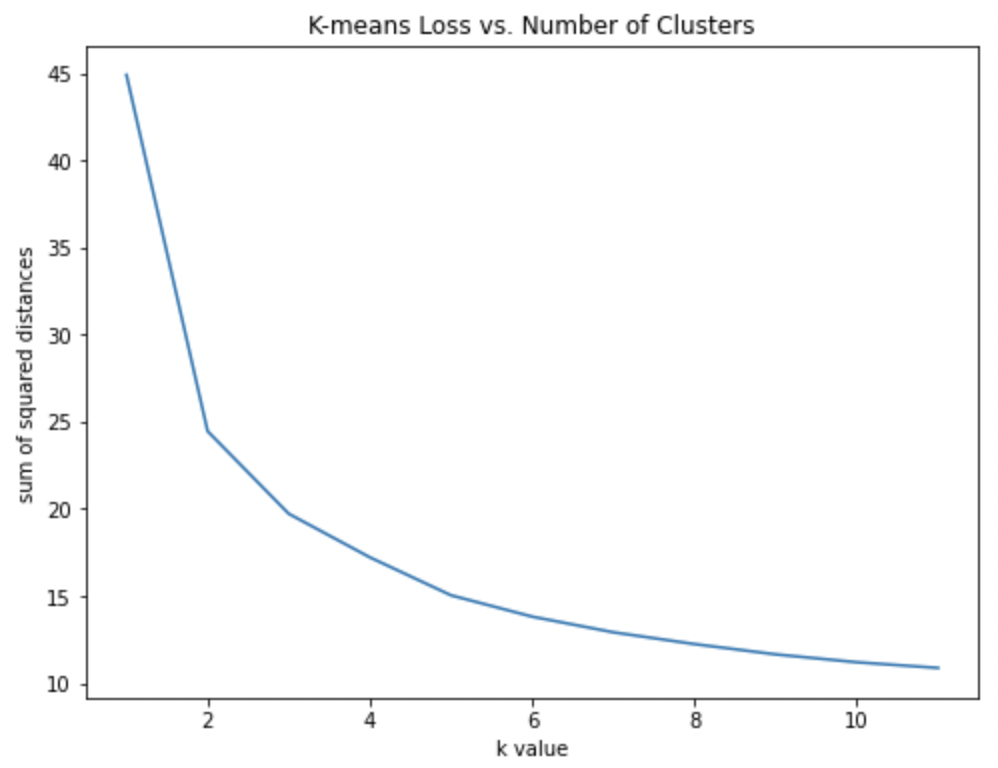
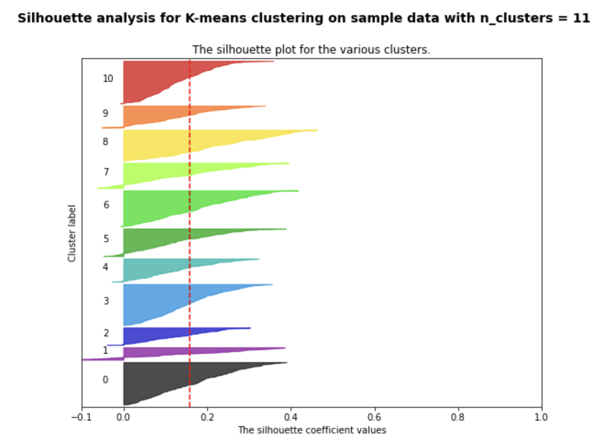

## **Authors: Ryan Cooper, Cuong Nguyen, Evan Downs, Rhythm M. Syed, Hamna Khan**

## **Introduction**
### **Introduction and Background:**
The current review process of submissions to academic conferences is a manual task, typically done by fellow academics and requires long hours of reading. Initial pre-screening of papers must be done to determine if a paper’s content is relevant to a particular conference’s list of relevant topics. For this project, we are interested in automating this screening process to expedite the paper selection procedure, such that relevant papers receive priority for further review by the committee and that papers are sent to researchers with relevant expertise on the paper’s topic.

### **Problem Definition:**
We will develop this work in two phases of supervised and unsupervised learning. For Supervised Learning we can define the problem: Given an abstract X, perform a classification from Y labels containing the list of relevant topics and a category of not-relevant. For Unsupervised, generate K clusters that represent topics found in a historical set of documents that were accepted to a particular conference in the past. Given this unsupervised model and a new input text, use an embedding-based  similarity score to determine the basis of acceptance. We propose directly comparing supervised and unsupervised learning in order to solve the task of automating conference paper screening.

## **Methods**
### **Data Collection:**

A major part of our project has been devoted to developing our own custom dataset of research papers from specific conferences. With this effort, we focused on collecting papers specifically from the EMNLP conference. We chose EMNLP over other conferences because of the focus on NLP related topics. Had we chosen a conference such as ICML which focuses more on a broad variety of ML topics, the separability between topics would become much blurrier and therefore harder to learn. With the EMNLP conference, we collected the topics of interest from previous years and reduced the number of classifications down to 11 classes including: Linguistics, Text Generation, Sentiment Analysis, ML for NLP, Q&A, NLP Applications, Social Science, Information Extraction, Speech, Resources and Evaluation, and Negative Samples. We provide further detail about the dataset in the Appendix Section. Given these classes, we hand labeled datasets of papers from EMNLP 2020 and 2019, choosing 2 labels that best represent a paper’s abstract. To collect the papers for both year’s conferences, we developed a scraper that collected data from aclweb.org such as title, abstract, author list, and pdf url. To generate the negative samples for our dataset, we utilized the arXiv dataset and collected papers from all topics excluding Information Retrieval, Computational Linguistics, Computers and Society, Social and Information Networks, and General Literature. Altogether, our final dataset contained 1450 samples, 700 of which are negative samples. Given this dataset, the next step is to generate word embeddings and train our models (supervised and unsupervised).

### **Data Preprocessing**
The dataset's explanatory variable of interest is the given abstract and the response variable is the label indicating the given abstract's class. Before featurizing the abstract's text, extensive cleaning is necessary. While the type of text cleaning can differ between models, all the techniques will be introduced here and the use cases will be explained in the following sections. One method is ensuring that all the text within each abstract only includes alphabetic characters and spaces. All punctuation and special characters are removed in order to reduce the complexity of the representation. For further reducing the size of the abstracts, stop words such as the, an, our, etc. are removed from each abstract. Lemmatization is also used in some cases to reduce words to their root in order to be able to map similar words to the same representation. Tagging is also used when it is necessary to only focus on a word's part of speech. This technique can be helpful in reducing the size of each abstract's representation.  
- Cleaning/Stopword
- Stemming/Lemmatizer
- Implementation

### **Language Models**
#### *BoW*
        
Bag of words is a classical approach to creating sparse feature vectors of documents by generating counts of each word in the sentence, where each index in the vector represents a word in the corpus and the value at this index is the count in the document. Since each vector's dimensionality is equal to the size of the vocabulary in the corpus, these vectors can be quite unruly to work with and also suffer from the fact that distance in the feature space has no tangible meaning.

#### *Trained W2V*
Word2vec models are helpful in capturing a representation of a word based upon the context that the word is used in. A famous linguist Firth explains the motivation for this technique by stating "You shall know a word by the company it keeps". There are many pre-trained word2vec models that can be utilized, but they are often biased to the topics in the corpus they are trained on. In order to ensure words have domain specific meaning to the corpus used, a word2vec model trained on the corpus may provide a more clear representation of corpus specific terms. A skipgram word2vec model built using negative sampling loss and optimized with stochastic gradient descent is implemented on the entire corpus specific to the dataset used. We train both a 13 dimensional and 50 dimensional version of this model on our corpus.

#### *GloVe*
GloVe is a set of word embeddings trained by researchers at Stanford in 2014 using Wikipedia, Twitter, and a Common Crawl dataset [4]. These vectors are trained by aggregating global word-word co-occurrence statistics from a corpus and the resulting representations show linear substructures in the semantic space, allowing for analogies such as: man to woman as to king and queen, to be represented in the semantic space. GloVe is a fairly standard pre-trained Word2Vec model and serves as a good starting place for many NLP classification tasks.

#### *Fine-tuned GloVe*
To further improve upon the pre-trained word embeddings, we thought that possibly fine-tuning GloVe with our corpus could prove valuable as it would include out-of-vocabulary words, and further align the feature space with the co-occurrences in the training corpus. Utilizing a package called mittens, fine-tuning GloVe embeddings becomes easy and generating this language model aligns the feature space to be task-specific.

#### *BERT*

BERT (Bidirectional Encoder Representations from Transformers) is a recent paper published by researchers at Google AI Language. BERT makes use of Transformer, an attention mechanism that learns contextual relations between words (or sub-words) in a text. In its vanilla form, Transformer includes two separate mechanisms — an encoder that reads the text input and a decoder that produces a prediction for the task. Since BERT’s goal is to generate a language model, only the encoder mechanism is necessary. The full architecture is described in [7]. 

#### *SciBERT*

SciBERT is a BERT model trained on scientific text. SciBERT is trained on papers from the corpus of semanticscholar.org. Corpus size is 1.14M papers, 3.1B tokens. Its results are state-of-the-art performance on a wide range of scientific domain nlp tasks. This serves as the SOTA model for our task.

## **Supervised Learning**
### *A. Task Introduction*
The formulation of supervised learning on our dataset is as follows: Given N abstracts (N = 1450) (which is featurized in the previous steps as an N-dimensional embedding), we build model that could classify future paper abstracts as belonging to either one of the positive NLP topics (1-10) or is a negative sample (11). We split the data 80-20 into a training set (N = 1160) and a test set (N = 290), stratifying by label classes so that there are similar amounts of samples per class between the training set and test set. 
### **B. Supervised Learning Models**
For this task, we consider the following supervised learning models:
#### *SVM*
Support Vector Machine is a linear model that can be utilized for both binary and multiclass classification, in addition to regression. It differentiates classes with a line or hyperplane and is effective in high dimensional spaces.   
#### *Gaussian Process*
Gaussian processes are utilized to solve both regression and classification problems. They are defined by the Gaussian distribution, can be molded by the covariance matrix, and output probabilistic predictions (soft classification).
#### *Decision Tree*
Decision trees are models utilized for both classification and regression. They primarily learn from data features in order to create decision rules for future prediction.  
#### *Random Forest*
Random Forest is a type of bagging ensemble learning method that can be applied to both classification and regression problems. It works by fitting multiple decision tree classifiers on different samples of the dataset and averages the outputs to improve predictions.
#### *Neural Networks (MLP)*
Neural networks consist of connected neurons organized into layers, featuring non-linear activation functions. They are trained using backpropagation techniques and can distinguish non-linearly separable data.
#### *AdaBoost*
AdaBoost is a boosting ensemble method that trains weak individual decision tree models sequentially in order to adapt to misclassified data points. More accurate classifiers are given larger weight to contribute to the output prediction, thus capitalizing the accuracy of the overall system. 
#### *Naive Bayes*
Naive Bayes classifiers work by applying Bayes’ theorem with the assumption that there exists conditional independence between features of the data. Because of this “naive” assumption, these classifiers are fast and work well with high dimensional data.
#### Bagging 
Bagging is a technique utilized to reduce overfitting of data. It involves fitting multiple classifiers on various subsets of the dataset and building an overall prediction from a combination of the outputs of these individual models.
### **C. Tasks**
For each of these models detailed in section B, we use grid search with 10-fold cross-validation in order to find the best-performing hyperparameter combination. We report the hyperparameters considered for each model in the results section below. We perform supervised learning for the following 3 tasks:
- Binary Classification (BC): We treat all 10 positive classes as a single label, and perform classification with that label (1) and negative samples (0) as the other label.
- Multiclass Classification - Positive Only (MC-PO): We discarded all samples that was labeled as a negative sample, and performed classification on the remaining data that was labeled as one of the NLP topics (1 - 10)
- Multiclass Classification - Full (MC-F): We perform classification on the dataset without any modifications (1 - 11)

### **D. Balancing the dataset**
Because our dataset is imbalanced, especially among the positive classes, we experimented with SMOTE as a method to fix this imbalance. In summary, SMOTE oversamples classes that are in the minority by taking samples from that class and consider their k nearest neighbors in the feature space. Synthetic data points are then created by randomly taking a vector between one of those k neighbors and the current data point, multiplying it by a factor between 0 and 1, and adding it to the original data point. We executed sklearn’s SMOTE implementation on the dataset and re-ran the MC-PO task for further analysis. After rebalancing, every positive class (1-10) contains 132 samples

## **Unsupervised Learning**
### *A. Task Introduction*
Similar to the task introduced in the supervised case, in the scope of unsupervised learning we assume no knowledge about the labels of our corpus. Given a sufficiently representative language model and semantic space, it becomes feasible to try various techniques of clustering, distance thresholding, and other methods to attempt BC, BC-PO, and MC-F. In the scope of real world applications, we see unsupervised as a much more realistic approach as it assumes little to no information apriori.

### Unsupervised Learning models

#### Classification in Semantic Space
Given that each document can be represented as some n-dimensional vector, it becomes reasonable for us to consider similarities and distances as measaurements for class membership. Consider the MC-PO example, where we have 10 class labels whose papers are distributed in the semantic space. Assume that we could approximate an ideal vector for representing this class, obtained in practice through domain expert descriptions or even as we show with simply the titles of the labels themselves. Using these label vectors, we minimize the inverse cosine similarity or the euclidian distance to assign a class to each of the unlabelled data points.

#### *LDA*
LDA (Latent Dirichlet Allocation) is an unsupervised learning method that is based on treating each document as a mixture of topics and each topic as a mixture of words. At a high level the method updates the probability of a word being assigned to a topic and a document being assigned to a topic.  Two required hyperparameters for this model are alpha which specifies the level of topic mixtures that should be present in a documents' classification, and beta which represents the amount of words that should be used in a topic. The number of topics also needs to be specified before running the model. This model is implemented over the text abstracts to see if topics are distinguishable. Since it is known that there are 11 labels, LDA can be tested to see if it can separate out the document into 11 classes. This method can validate how distinguishable 11 classes are. LDA can also be used for dimensionality reduction. Since each abstract is assigned a probability of belonging to each class, the distribution over the number of classes can represent an engineered feature of the abstract. The dimensionality of this feature is the number of topics chosen.

#### *K-means*
The K-means algorithm uses Euclidean distance to measure the closeness between data points and pre-defined number of clusters. Similar to LDA's use case above, this model is useful in the analysis since the number of clusters can be chosen to represent the expected number of clusters in the dataset. Given that word vectors are used as the input data, K-means' centroid output could be used to represent centered word vectors for each cluster. These centered word vectors could be useful in mapping pre-defined topic summary word vectors to the closest center word vector from K-means. This process can lead to a semi-supervised approach to automatic labeling of K-means' cluster output.

#### *Gaussian Mixture Model*
To further test the separability of the training samples, Gaussian Mixture Models can be used to determine if different shaped decision boundaries are more appropriate for separating the dataset. Since K-means is Euclidean distance based, its decision boundaries will be spherical. However, Gaussian Mixture Models will have decision boundaries representing the shape of the respective distribution leading to different ellipse shaped decision boundaries. Silhouette scores will be used to compare K-means and Gaussian Mixture Models to see which one performs best.

## **Results**
### **Unsupervised Learning**
#### **A. LDA Topic modeling**

The visualizations for the topic distributions of LDA with 3 topics and for LDA with 11 topics is seen in the figures below. 11 topics are chosen since it is known a-priori that there are 11 topics within the abstracts. The visualization for 11 topics does show that there is some overlap between words assigned to various topics. This observation shows that 11 topics may be too difficult to distinguish effectively in the dataset. 3 topics is used since it appears visually that there are 3 clear distinctions within the topics. This observation is reinforced through calculating coherence scores for each LDA model. The 11 topic model has a coherence score of 0.3349 and the 3 topic model has a coherence score of 0.3482. While they are similar, the 3 topic model's coherence score is slightly higher showing that the 3 topics are more human readable than the 11 topics generated.

#### **B. K-means**

A K-means model is developed using the custom 50 dimensional word2vec representations of the dataset. The above figure shows the sum of squared distances for a range of cluster values. Using the elbow method approximation there appears to be an elbow either at 2 clusters or 3 clusters since after those clusters there are not significant improvements in the sum of squared distance metric. The silhouette coefficient can be used to further show the optimal number of clusters.

| Number of Clusters | Silhoutte Coefficient |
|---|---|
| 2 | 0.3756 |
| 3 | 0.2578 |
| 4 | 0.2260 |
| 5 | 0.2243 |
| 6 | 0.2100 |
| 7 | 0.1960 |
| 8 | 0.1849 |
| 9 | 0.1787 |
| 10 | 0.1629 |
| 11 | 0.1588 |

Two silhouettes are shown above corresponding to K-means with 2 clusters and K-means with 11 clusters. THe silhouette plot for 2 clusters shows better separation between the clusters with an average silhouette score of 0.3756 and very few samples having less than 0 silhouette scores. However, the 11 cluster silhouette plot performs much worse at creating clear separation within the dataset. More samples within clusters have silhouette scores less than 0 which indicates the precense of overlapping classes. The sillhoutte scores of clusters inbetween 2 and 11 inclusive can be seen in the above table. It is clear that 2 clusters has the clearest distinction.

#### **C. Gaussian Mixture Model**

| Number of Clusters | Silhoutte Coefficient |
|---|---|
| 2 | 0.2528 |
| 3 | 0.0959 |
| 4 | 0.0109 |
| 5 | 0.0352 |
| 6 | 0.0122 |
| 7 | 0.0232 |
| 8 | 0.0306 |
| 9 | 0.0425 |
| 10 | 0.0367 |
| 11 | 0.0438 |

The silhouette trends for the Guassian Mixture Model (GMM) is similar to K-means with 2 clusters showing the best silhouette score. GMM is also observed to have an overall worse performance than K-means at separating the dataset into clear clusters. There are many more samples with coefficient values less than zero in GMM than K-means which shows there are more overlapping classes in GMM.

#### **D. LDA Classification**

LDA's generated 11 topic distribution over each abstract is tested briefly as an input for an SVM classifier. It is shown to reach a test set accuracy of 55.55% for multi-class labeling and a test accuracy of 86.50% for binary class labeling. While these scores are not as strong as the supervised classification using GloVe embeddings, they still hold up well in comparison for how simple their representations are. Since each feature represents an abstracts' distribution over topics, the engineered features can be more explainable than GloVe embeddings.

#### **E. Semi-Supervised K-means with Topic Summaries**

In this analysis the K-means centroid output can be viewed as centered word vectors that try to generalize the meaning of the word vectors assigned to each centroid. In this view, if ground truth word vector representations of the known classes are available, then these known representations can be assigned to each centroid through a given similarity metric. This idea is shown through first calculating word vector representations of each class in the dataset. This calculation involves going over abstracts assigned to each class and computing the cosine similarity of each abstract assigned to the same class and averaging the value. The abstracts with the five greatest average similarity scores are then selected for each class. Within each class these top 5 abstracts' word vectors are averaged to compute the ground truth word vector representation for the respective class. The cosine similiarity is then calculated for each ground truth representation to the 11 centroids from K-means and the centroid is mapped to the ground truth that has the greatest similarity. This method achieves 48.9% accuracy for multi-class labeling and 87.03% accuracy for binary classification.

#### **F. Language Model Visualization**
The word2vec model trained on the corpus is found to capture the contextual meaning of the words well. The word plot in the figure below shows a two dimensional representation of the trained 13 dimensional vectors. While some contextual meaning is lost in the dimensionality reduction, the plot still shows similar words grouped closer together and more unrelated words further apart. The words cache, memory, time, and latency are expected to be located around similar words contextually so it makes sense they are closer. Language, learning, bert, and machine are all heavily related to machine learning terminology so it makes sense that they are grouped closer together as well. Paper means something different from the other words so it is farther away which agrees with common sense. A more robust comparison involving all the dimensions is to use cosine similarity to compare two vectors. The vectors for cache and memory achieve a cosine similarity score  of 0.99 which is close to one indicating that the vectors are in a similar plane. However, time and paper have a cosine similarity score of 0.56 showing that they are not as related in the same dimension space.

These 2d and 3d visualizations are intended to represent a projection from the high dimensional semantic space, colored by binary class to illustrate the separability in the feature space. We find that the space is extremely separable for binary classification, but for multiclass, becomes more convoluted.

- *BOW*

- *Trained W2V*

- *GloVe*

- *GloVe Multi Class*

- *Finetuned GloVe*

- *BERT*

- *SciBERT*

#### **G. Language Model Comparison**

In order to understand the importance of the feature space we choose from various language models, we look at a baseline classification model, support vector machine for classification with rbf kernel, and compare the train and test (33% of the dataset) accuracies. We will explore optimizing the supervised techniques later, but let this serve as a comparison of each language models expressiveness.

- *MC-F (Multiclass Classification - Full)*

| Language Model | Training Accuracy | Testing Accuracy |
|---|---|---|
| BOW | 0.7569 | 0.4968 |
| CustomWord2Vec 13d | 0.6323 | 0.5908 |
| CustomWord2Vec 50d | 0.6364 | 0.5824 |
| GLOVE | 0.8959 | 0.6492 |
| Finetuned GLOVE | 0.8970 | 0.6388 |   
| BERT | 0.9134 | 0.6492 |
| SCIBERT | **0.9165** | **0.6805** |     

- *MC-PO (Multiclass Classification - Positive Only)*

| Language Model | Training Accuracy | Testing Accuracy |
|---|---|---|
| BOW | 0.8446 | 0.2217 |
| CustomWord2Vec 13d | 0.3944 | 0.2661 |
| CustomWord2Vec 50d | 0.4342 | 0.2903 |
| GLOVE | 0.9083 | 0.3991 |
| Finetuned GLOVE | 0.9083 | 0.3991 |   
| BERT | 0.9043 | 0.4153 |
| SCIBERT | **0.9143** | **0.4435** |

- *BC (Binary Classification)*

| Language Model   | Training Accuracy | Testing Accuracy |
|------------------|-------------------|------------------|
| BOW | 0.9824 | 0.7787 |
| CustomWord2Vec 13d | 0.9320 | 0.9206 |
| CustomWord2Vec 50d | 0.9361 | 0.9311 |
| GLOVE | 0.9886 | 0.9394 |
| Finetuned GLOVE | 0.9907 | 0.9415 |   
| BERT | 0.9938 | 0.9478 |
| SCIBERT | **0.9979** | **0.9749** |

We see that SciBERT seem to provide the most separability to the data in all tasks. 

#### **H. Model accuracies for classification**

In this section we show the results of using the methods described in "Classification in Semantic Space". Notice that each task has 2 sets of values, each representing the latent representation of the class in the semantic space. The first, "class descriptions" is derived from the topic descriptions for each label as described in Appendix B and nothing more. The other, "Semi-supervised k=5" is using the top 5 most representative abstracts averaged as a representation of the class. This represents the case where a conference organizer gives the researchers some sample papers for each class. We compare minimizing two values in the semantic space for class assignment: inverse cosine similarity and euclidean distance.

| Using Inverse Cosine Similarity | MC-F (class descriptions) | MC-F (Semi-supervised k=5) | MC-PO (class descriptions) | MC-PO (Semi-supervised k=5) | BC (class description) | BC (Semi-supervised k=5) |
|---------------------------------|---------------------------|-----------------------------------|---------------------------|-----------------------------------|------------------------|---------------------------------|
| CustomWord2Vec 13d              | 0.0613                    | 0.3931                            | 0.1186                    | 0.2133                            | 0.6972                 | 0.6227                          |
| CustomWord2Vec 50d              | 0.0572                    | 0.431                             | 0.1106                    | 0.2093                            | 0.6896                 | 0.6131                          |
| GLOVE                           | 0.0531                    | 0.4689                            | 0.1026                    | 0.3266                            | 0.6944                 | 0.7006                          |
| Finetuned GLOVE                 | 0.0531                    | 0.4696                            | 0.1026                    | 0.3253                            | 0.6979                 | 0.7096                          |
| BERT                            | 0.1462                    | 0.4565                            | 0.2826                    | 0.32                              | 0.7379                 | 0.8151                          |
| SCIBERT                         | 0.0813                    | 0.1758                            | 0.1573                    | 0.34                              | 0.742                  | 0.9110                           |

| Using Euclidian Distance | MC-F (class descriptions) | MC-F (Semi-supervised k=5) | MC-PO (class descriptions) | MC-O (Semi-supervised k=5) | BC (class description) | BC (Semi-supervised k=5) |
|--------------------------|---------------------------|-----------------------------------|---------------------------|-----------------------------------|------------------------|---------------------------------|
| CustomWord2Vec 13d       | 0.0621                    | 0.3931                            | 0.1200                      | 0.1853                            | 0.6675                 | 0.6717                          |
| CustomWord2Vec 50d       | 0.0586                    | 0.2903                            | 0.1133                    | 0.1626                            | 0.6551                 | 0.6200                            |
| GLOVE                    | 0.0503                    | 0.4655                            | 0.0973                    | 0.3053                            | 0.7144                 | 0.7503                          |
| Finetuned GLOVE          | 0.0586                    | 0.4613                            | 0.1133                    | 0.3053                            | 0.7186                 | 0.7489                          |
| BERT                     | 0.1434                    | 0.4544                            | 0.2773                    | 0.3173                            | 0.7489                 | 0.8227                          |
| SCIBERT                  | 0.0924                    | 0.5765                            | 0.1786                    | 0.3373                            | 0.7524                 | 0.9034                          |

Notice that we attain accuracies comparable to supervised with SOTA language models. 

## **Supervised Learning**
#### **Model accuracies**
Beginning with the BC task, which encodes whether or not a paper is included in the conference, we ran a logistic regression model yielding high prediction scores on training data and testing data. Moving forward to MC-F task, we experimented with multiple models and utilized grid search to fine-tune hyperparameters for the best fit. Our fitting of multiple models, finetuning of parameters, and prediction accuracies can be summarized in the tables below (only accuracy of best-performing hyperparameter was reported):

<!-- TODO: Update these with SciBERT, Finetuned glove and 50d trained w2v  -->

- *MC-F (Multiclass Classification - Full)*

| Language Model               | Hyperparameters                                                                                                                                                     | Best Hyperparameters                                                                                             | Best Test Accuracy  |
|------------------------------|---------------------------------------------------------------------------------------------------------------------------------------------------------------------|------------------------------------------------------------------------------------------------------------------|---------------------|
| SVM                          | {'kernel': ['linear', 'rbf', 'poly', 'sigmoid], 'C':[0.01, 0.1, 1], 'gamma': ['scale', 'auto']}                                                                     | {'C': 1, 'gamma': 'scale', 'kernel': 'linear'}                                                                   | 0.6655172413793103  |
| Gaussian Process             | {'kernel': [1.0 * RBF(1.0)]}                                                                                                                                        | {'kernel': [1.0 * RBF(1.0)]}                                                                                     | 0.6206896551724138  |
| **Logistic Regression**          |                                                                                                                                                                     | **{'max_iter': 10000, 'random_state': 0}**                                                                       | **0.6689655172413793**  |
| Decision Tree                | {'max_depth': [5, 15, None], 'criterion': ['gini', 'entropy'], 'splitter': ['best', 'random'], 'max_features':[None, 'auto'], 'min_weight_fraction_leaf': [0, 0.1]} | {'criterion': 'gini', 'max_depth': 5, 'max_features': None, 'min_weight_fraction_leaf': 0.1, 'splitter': 'best'} |  0.5275862068965518 |
| Random Forest                | {'max_depth': [5, 15, None], 'n_estimators': [10, 100], 'max_features': [None]}                                                                                     | {'max_depth': None, 'max_features': None, 'n_estimators': 100}                                                   | 0.6137931034482759  |
| MLP                          | {'alpha': [0.001, 0.01, 0.1], 'max_iter': [10000], 'early_stopping': [False, True], 'beta_2': [0.999]}                                                              | {'alpha': 0.1, 'beta_2': 0.999, 'early_stopping': False, 'max_iter': 10000}                                      | 0.6379310344827587  |
| AdaBoost                     | 'AdaBoost': {'n_estimators': [50, 100, 200], 'learning_rate': [0.1, 0.5, 1]}                                                                                        | {'learning_rate': 0.1, 'n_estimators': 50}                                                                       | 0.5103448275862069  |
| Naive Bayes                  | NaiveBayes': {}                                                                                                                                                     | {}                                                                                                               | 0.5896551724137931  |
| Bagging Classifier           | 'BaggingClassifier': {'base_estimator': [SVC()], 'n_estimators': [10], 'random_state': [0]}                                                                         | {'base_estimator': SVC(), 'n_estimators': 10, 'random_state': 0}                                                 | 0.6103448275862069  |
| Gradient Boosting Classifier | {'learning_rate': [0.1, 0.2, 0.5], 'n_estimators': [100, 500, 1000], 'max_depth': [3, 9, 15]}                                                                       | {'learning_rate': 0.1, 'max_depth': 3, 'n_estimators': 500, 'n_iter_no_change': 5}                                                                                                            |0.603448275862069             |

- *BC (Binary Classification)*

| Language Model               | Hyperparameters                                                                                                                                                     | Best Hyperparameters                                                                                                 | Best Test Accuracy     |
|------------------------------|---------------------------------------------------------------------------------------------------------------------------------------------------------------------|----------------------------------------------------------------------------------------------------------------------|------------------------|
| SVM                          | {'kernel': ['linear', 'rbf', 'poly', 'sigmoid], 'C':[0.01, 0.1, 1], 'gamma': ['scale', 'auto']}                                                                     | {'C': 1, 'gamma': 'scale', 'kernel': 'rbf'}                                                                          | 0.9206896551724137     |
| Gaussian Process             | {'kernel': [1.0 * RBF(1.0)]}                                                                                                                                        | {'kernel': [1.0 * RBF(1.0)]}                                                                                         | 0.9379310344827586     |
| Logistic Regression          |                                                                                                                                                                     | {'max_iter': 10000, 'random_state': 0}                                                                               | 0.9172413793103448     |
| Decision Tree                | {'max_depth': [5, 15, None], 'criterion': ['gini', 'entropy'], 'splitter': ['best', 'random'], 'max_features':[None, 'auto'], 'min_weight_fraction_leaf': [0, 0.1]} | {'criterion': 'entropy', 'max_depth': None, 'max_features': None, 'min_weight_fraction_leaf': 0, 'splitter': 'best'} | 0.7206896551724138     |
| Random Forest                | {'max_depth': [5, 15, None], 'n_estimators': [10, 100], 'max_features': [None]}                                                                                     | {'max_depth': None, 'max_features': None, 'n_estimators': 100}                                                       | 0.8758620689655172     |
| **MLP**                      | {'alpha': [0.001, 0.01, 0.1], 'max_iter': [10000], 'early_stopping': [False, True], 'beta_2': [0.999]}                                                              | **{'alpha': 0.1, 'beta_2': 0.999, 'early_stopping': False, 'max_iter': 10000}**                                      | **0.9482758620689655** |
| AdaBoost                     | 'AdaBoost': {'n_estimators': [50, 100, 200], 'learning_rate': [0.1, 0.5, 1]}                                                                                        | {'learning_rate': 0.5, 'n_estimators': 200}                                                                          | 0.9103448275862069     |
| Naive Bayes                  | NaiveBayes': {}                                                                                                                                                     | {}                                                                                                                   | 0.8482758620689655     |
| Bagging Classifier           | 'BaggingClassifier': {'base_estimator': [SVC()], 'n_estimators': [10], 'random_state': [0]}                                                                         | {'base_estimator': SVC(), 'n_estimators': 10, 'random_state': 0}                                                     | 0.9206896551724137     |
| Gradient Boosting Classifier | {'learning_rate': [0.1, 0.2, 0.5], 'n_estimators': [100, 500, 1000], 'max_depth': [3, 9, 15]}                                                                       | {'learning_rate': 0.1, 'max_depth': 3, 'n_estimators': 500, 'n_iter_no_change': 5}                                   | 0.896551724137931      |

- *MC-PO (Multiclass Classification - Positive Only)*

| Language Model               | Hyperparameters                                                                                                                                                     | Best Hyperparameters                                                                                                   | Best Test Accuracy  |
|------------------------------|---------------------------------------------------------------------------------------------------------------------------------------------------------------------|------------------------------------------------------------------------------------------------------------------------|---------------------|
| SVM                          | {'kernel': ['linear', 'rbf', 'poly', 'sigmoid], 'C':[0.01, 0.1, 1], 'gamma': ['scale', 'auto']}                                                                     | {'C': 1, 'gamma': 'scale', 'kernel': 'linear'}                                                                         | 0.3933333333333333  |
| Gaussian Process             | {'kernel': [1.0 * RBF(1.0)]}                                                                                                                                        | {'kernel': [1.0 * RBF(1.0)]}                                                                                           | 0.38                |
| Logistic Regression          |                                                                                                                                                                     | {'max_iter': 10000, 'random_state': 0}                                                                                 | 0.4                 |
| Decision Tree                | {'max_depth': [5, 15, None], 'criterion': ['gini', 'entropy'], 'splitter': ['best', 'random'], 'max_features':[None, 'auto'], 'min_weight_fraction_leaf': [0, 0.1]} | {'criterion': 'entropy', 'max_depth': 15, 'max_features': None, 'min_weight_fraction_leaf': 0.1, 'splitter': 'random'} | 0.26666666666666666 |
| Random Forest                | {'max_depth': [5, 15, None], 'n_estimators': [10, 100], 'max_features': [None]}                                                                                     | {'max_depth': None, 'max_features': None, 'n_estimators': 100}                                                         | 0.38                |
| MLP                          | {'alpha': [0.001, 0.01, 0.1], 'max_iter': [10000], 'early_stopping': [False, True], 'beta_2': [0.999]}                                                              | 'alpha': 0.1, 'beta_2': 0.999, 'early_stopping': False, 'max_iter': 10000}                                             | 0.36                |
| AdaBoost                     | 'AdaBoost': {'n_estimators': [50, 100, 200], 'learning_rate': [0.1, 0.5, 1]}                                                                                        | {'learning_rate': 0.1, 'n_estimators': 200}                                                                            | 0.3                 |
| **Naive Bayes**              | NaiveBayes': {}                                                                                                                                                     | **{}**                                                                                                                 | **0.44**            |
| Bagging Classifier           | 'BaggingClassifier': {'base_estimator': [SVC()], 'n_estimators': [10], 'random_state': [0]}                                                                         | {'base_estimator': SVC(), 'n_estimators': 10, 'random_state': 0}                                                       | 0.30666666666666664 |
| Gradient Boosting Classifier | {'learning_rate': [0.1, 0.2, 0.5], 'n_estimators': [100, 500, 1000], 'max_depth': [3, 9, 15]}                                                                       | {'learning_rate': 0.1, 'max_depth': 3, 'n_estimators': 500, 'n_iter_no_change': 5}                                     | 0.34                |

- *MC-PO - Balanced (Multiclass Classification - Positive Only, Balanced with SMOTE)*

| Language Model               | Hyperparameters                                                                                                                                                     | Best Hyperparameters                                                                                               | Best Test Accuracy     |
|------------------------------|---------------------------------------------------------------------------------------------------------------------------------------------------------------------|--------------------------------------------------------------------------------------------------------------------|------------------------|
| SVM                          | {'kernel': ['linear', 'rbf', 'poly', 'sigmoid], 'C':[0.01, 0.1, 1], 'gamma': ['scale', 'auto']}                                                                     | {'C': 1, 'gamma': 'scale', 'kernel': 'linear'}                                                                     | 0.35517241379310344    |
| Gaussian Process             | {'kernel': [1.0 * RBF(1.0)]}                                                                                                                                        | {'kernel': [1.0 * RBF(1.0)]}                                                                                       | 0.44482758620689655    |
| Logistic Regression          |                                                                                                                                                                     | {'max_iter': 10000, 'random_state': 0}                                                                             | 0.32413793103448274    |
| Decision Tree                | {'max_depth': [5, 15, None], 'criterion': ['gini', 'entropy'], 'splitter': ['best', 'random'], 'max_features':[None, 'auto'], 'min_weight_fraction_leaf': [0, 0.1]} | {'criterion': 'entropy', 'max_depth': 15, 'max_features': None, 'min_weight_fraction_leaf': 0, 'splitter': 'best'} | 0.43103448275862066    |
| Random Forest                | {'max_depth': [5, 15, None], 'n_estimators': [10, 100], 'max_features': [None]}                                                                                     | {'max_depth': None, 'max_features': None, 'n_estimators': 100}                                                     | 0.4413793103448276     |
| **MLP**                      | {'alpha': [0.001, 0.01, 0.1], 'max_iter': [10000], 'early_stopping': [False, True], 'beta_2': [0.999]}                                                              | **{'alpha': 0.01, 'beta_2': 0.999, 'early_stopping': False, 'max_iter': 10000}**                                   | **0.4482758620689655** |
| AdaBoost                     | 'AdaBoost': {'n_estimators': [50, 100, 200], 'learning_rate': [0.1, 0.5, 1]}                                                                                        | {'learning_rate': 0.1, 'n_estimators': 200}                                                                        | 0.20344827586206896    |
| Naive Bayes                  | NaiveBayes': {}                                                                                                                                                     | {}                                                                                                                 | 0.29310344827586204    |
| Bagging Classifier           | 'BaggingClassifier': {'base_estimator': [SVC()], 'n_estimators': [10], 'random_state': [0]}                                                                         | {'base_estimator': SVC(), 'n_estimators': 10, 'random_state': 0}                                                   | 0.30344827586206896    |
| Gradient Boosting Classifier | {'learning_rate': [0.1, 0.2, 0.5], 'n_estimators': [100, 500, 1000], 'max_depth': [3, 9, 15]}                                                                       | {'learning_rate': 0.1, 'max_depth': 3, 'n_estimators': 500, 'n_iter_no_change': 5}                                 | 0.43448275862068964    |

## **Discussion**
### **Language Models**

We presented a variety of language models used to generate semantic spaces for learning. We explore trivial methods like bag of words, and word2vec techniques including training our own model over our corpus, to even evaluating pretrained and finetuned versions of GloVE. Finally, we look at modern language models like BERT and SCIBERT as representing the most feature-rich semantic spaces. After evaluation, we found that SciBERT produced the most feature-rich semantic space. We use this model to show the SOTA limits of our dataset.

<!-- TODO: Add more here? -->

### **Unsupervised Learning**

Through observing the outputs of LDA, K-means, and GMM models, the dataset can be most effectively grouped into a small number of groups varying between 2 to 3 classes. The 2 distinct unsupervised groupings can be connected to the separation of the positive and negative samples inherent in the dataset. When the unsupervised models are trained with 11 clusters, the models struggle to create clear distinctions with low silhouette scores. These observations show that the binary classification of the dataset should be effective, but multi-class classification will be difficult to achieve with the current state of the samples.

It is shown that the unsupervised models' output can act as engineered features for a supervised learning task with LDA's output for each data point representing the probability distribution over the number of topics. However, the performance achieved with this method did not exceed the performance with alternative reprseentations of the dataset.

A semi-supervised approach for labeling unsupervised cluster outputs is developed and acceptable performance on binary classification tasks with an accuracy of 87.03%. The strength of this method is that only 5 abstracts need to be collected as being representative of a topic in order for classification of future abstracts to be performed. This decrease in data collection allows the model to be more flexible in the way it can be distributed and generalized on different research paper separation tasks. Although this method does not perform as highly as the supervised models, it is still recommended to use in situations where lengthy data collection would be difficult.

<!-- TODO: Talk about real world workflow, results from unsupervised classification -->
As an extension of the semi-supervised method, an approach involving direct distance calculations between the topic summary word vectors and each abstract's word vectors is implemented. Both Euclidean and inverse cosine similarity distances are used to compare abstracts directly with the topic summaries. The topic summaries use either the top 5 abstracts for each class as described in the semi-supervised approach or the class descriptions directly which can be seen in Appendix B. Each of these methods are performed on each language model built. The results show that the greatest binary classification is with SCIBERT at 0.9110 using inverse cosine similarity and the semi-supervised topic summary approach. The greatest multi classification is also with SCIBERT at 0.58 using Euclidean distance and semi-supervised topics. The greatest multi classification excluding negatives samples is with SCIBERT at 0.34 using inverse cosine similarity and semi-supervised topics. Overall it is observed that the semi-supervised topic summaries perform better than the direct class descriptions. The class descriptions only achieve its highest accuracy at 0.74 for binary classification. The benefit of the class descriptions is that it uses the least amount of data collection besides collecting a predefined list of topics for a conference. This method could be useful in situations where the research conference wants a very quick approach in binary classification. However, if more accuracy is desired the conference could provide 5 abstracts that they think are representative of a topic in the conference and then the semi-supervised approach could be used.

### **Supervised Learning**

<!-- TODO: Update with new discussion -->

We found that our best results were sourced in the binary classification (BC) task. We achieved our highest test accuracy using neural networks, particularly a Multi-layer Perceptron classifier, which achieved almost 95% test accuracy. Our model was thus able to successfully differentiate between papers that were included in the EMNLP 2020 conference and those that were ultimately excluded from it. This would be valuable in that our model can screen out irrelevant papers from the pool of papers submitted to a given conference with high accuracy, and thus reduce some element of required human consideration. 

The more complex task of multiclass classification yielded lower results, as expected. For full multiclass classification (MC-F) with all classes, the best test accuracy of about 67% was achieved by our linear regression model. Thus, our model was able to classify the given papers into the eleven classes according to their topic with mid-level accuracy. We should note that this classification included the negative samples class (Class 11). An effort to classify papers according to only positive sample classes was done in the following task of MC-PO, in which the average accuracy decreased further. The best test accuracy for the MC-PO task was achieved by the Naive Bayes classifier, with a value of 44%. This reveals that about a third of the accurate classification that was done in the MC-F task was sourced in classifying papers into the negative class. An effort to balance the dataset for the positive classes such that all classes contain the same number of samples did not provide significant improvement. This was reflected in our results of the MC-PO Balanced task after dataset balancing via SMOTE, where our neural network MLP model achieved the best test accuracy of about 45%. 
 
## **Conclusion**
In this project, we demonstrated the feasibility of automatically detecting the topic of an academic paper based on its topic. Using unsupervised language models such as GloVE and BERT, we showed that there is significant linear seperability of embeddings between in-conference samples and out-of-conference samples. Using supervised methods, we have shown that a Multi-Layered Perceptron classifier trained on only around 1000 abstracts can distinguish between in-conference papers and out-of-conference papers with a 95% accuracy rate. Future work could be done to improve accuracy of multi-class classification to achieve more promising topic classification of papers. 

## References
 
[1] Devlin, J., Chang, M.-W., Lee, K., and Toutanova, K., “BERT: Pre-training of Deep Bidirectional Transformers for Language Understanding”, <i>arXiv e-prints</i>, 2018.
 
[2] Minaee, S., Kalchbrenner, N., Cambria, E., Nikzad, N., Chenaghlu, M., and Gao, J., “Deep Learning Based Text Classification: A Comprehensive Review”, arXiv e-prints, 2020.  

[3] Jelodar, H., “Latent Dirichlet Allocation (LDA) and Topic modeling: models, applications, a survey”, arXiv e-prints, 2017.

[4] Pennington, Jeffrey & Socher, Richard & Manning, Christopher. (2014). GloVe: Global Vectors for Word Representation. EMNLP. 14. 1532-1543. 10.3115/v1/D14-1162.

[5] Iz Beltagy, Kyle Lo, & Arman Cohan (2019). SciBERT: Pretrained Language Model for Scientific Text. In EMNLP.  

[6] https://github.com/roamanalytics/mittens. 

[7] Ashish Vaswani, Noam Shazeer, Niki Parmar, Jakob Uszkoreit, Llion Jones, Aidan N. Gomez, Lukasz Kaiser, & Illia Polosukhin. (2017). Attention Is All You Need.

## **Appendix**
### **A. Data Label Frequencies**

| 1  | 2   | 3  | 4   | 5  | 6  | 7  | 8  | 9  | 10 | 11  |
|----|-----|----|-----|----|----|----|----|----|----|-----|
| 81 | 165 | 36 | 139 | 65 | 56 | 28 | 71 | 11 | 98 | 700 |

### **B. NLP Topics** 

| Class | Topic Name | Topic Description |
|---------|--------------------------|----------------------------------------------------------------------------------------------------------------------------------------------|
| Class1  | Linguistics              | Syntax, Phonology, Morphology and Word Segmentation, Linguistic Theories, Cognitive Modeling and Psycholinguistics, Discourse and Pragmatics |
| Class2  | Text_Generation          | Generation & Summarization & Machine Translation and Multilinguality,                                                                        |
| Class3  | Sentiment_Analysis       | Sentiment Analysis, Stylistic Analysis, and Argument Mining                                                                                  |
| Class4  | ML_for_NLP               | Machine Learning for NLP and Interpretability and Analysis of Models for NLP                                                                 |
| Class5  | Q&A                      | Dialogue, Speech and Interactive Systems + Question Answering                                                                                |
| Class6  | NLP Applications         | NLP Applications, Language Grounding to Vision, Robotics and Beyond                                                                          |
| Class7  | Social_Science           | Computational Social Science and Social Media                                                                                                |
| Class8  | Information Extraction   | Information Extraction & Information Retrieval and Text Mining                                                                               |
| Class9  | Speech                   | Speech and Multimodality                                                                                                                     |
| Class10 | Resources and Evaluation | Resources and Evaluation                                                                                                                     |
| Class11 | Negative Samples         |                                                                                                                                              |

### **C. Contributions**
- Ryan Cooper:
- Johnny Nguyen:
- Rhythm Syed:
- Hamna Khan:
- Evan Downs:
